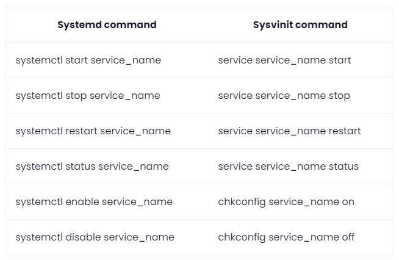

# Ubuntu 22.04离线安装Docker和NVIDIA Container Toolkit

## 一、离线安装Docker

### 1. 在[Docker官方下载链接](https://link.zhihu.com/?target=https%3A//download.docker.com/linux/static/stable/x86_64/)找到 Ubuntu系统对应的Docker安装包，下载docker-24.0.6.tgz版本


### 2. 把docker-24.0.6.tgz上传到服务器，并解压，解压命令如下：

```text
tar xzvf docker-24.0.6.tgz
```


### 3. 把解压缩的文件移动到目录/usr/local/bin/

```text
sudo mv docker/* /usr/local/bin/
```

### 4. 创建 docker.service配置文件

```text
sudo vim /etc/systemd/system/docker.service
```

把下面的内容复制到配置文件中并保存退出

```text
[Unit]
Description=Docker Application Container Engine
After=network-online.target firewalld.service
Wants=network-online.target

[Service]
Type=notify
ExecStart=/usr/local/bin/dockerd
ExecReload=/bin/kill -s HUP $MAINPID
Restart=always
RestartSec=2
StartLimitBurst=3
StartLimitInterval=60s
LimitNOFILE=infinity
LimitNPROC=infinity
LimitCORE=infinity
Delegate=yes
KillMode=process

[Install]
WantedBy=multi-user.target
```

### 5. 依次添加配置文件权限、加载配置文件、启动Docker，命令如下：

```text
sudo chmod +x /etc/systemd/system/docker.service
sudo systemctl daemon-reload
sudo systemctl start docker
```


### 6. 查看Docker是否已在运行

```text
sudo systemctl status docker
```


### 7. 查看Docker版本号以进一步验证Docker是否安装成功

```text
sudo docker –version
```


### 8. 将Docker服务设置为开机自启动

```text
sudo systemctl enable docker
```


## 二、离线安装NVIDIA Container Toolkit

### 1. 在NVIDIA的[GitHub主页](https://github.com/NVIDIA/libnvidia-container/tree/gh-pages/stable/deb/amd64)找到Ubuntu系统对应的NVIDIA Container Toolkit安装包

该页面的安装包较多，搜索关键词“1.14.1”，下载所有含有“1.14.1”的安装包，安装包的说明如下

```text
libnvidia-container1_1.14.1-1_amd64.deb           # 基础库包，提供了最基本的功能，其他包都依赖于它
libnvidia-container-tools_1.14.1-1_amd64.deb      # 基础工具包，依赖于 libnvidia-container1
nvidia-container-toolkit-base_1.14.1-1_amd64.deb  # 基础组件包，依赖于前面的包
nvidia-container-toolkit_1.14.1-1_amd64.deb       # 主要的工具包，依赖于以上所有包
libnvidia-container1-dbg_1.14.1-1_amd64.deb       # 调试符号包，只在调试问题时使用
libnvidia-container-dev_1.14.1-1_amd64.deb        # 开发包，只在进行开发时使用
```

其中最后两个安装包可以选择不下载和不安装


### 2. 执行下列命令安装NVIDIA Container Toolkit：

```text
sudo dpkg -i libnvidia-container1_1.14.1-1_amd64.deb
sudo dpkg -i libnvidia-container-tools_1.14.1-1_amd64.deb
sudo dpkg -i nvidia-container-toolkit-base_1.14.1-1_amd64.deb
sudo dpkg -i nvidia-container-toolkit_1.14.1-1_amd64.deb
```


### 3. 查看NVIDIA Container Toolkit的版本以验证是否安装成功

```text
nvidia-ctk --version
```


### 4. 设置Docker默认使用NVIDIA runtime

```text
sudo nvidia-ctk runtime configure --runtime=docker
```


### 5. 重启Docker

```text
sudo systemctl restart docker
```


> [!CAUTION]
>
> [修复 "System has not been booted with systemd as init system "的错误。](https://www.cnblogs.com/a5idc/p/13752839.html)
>
> 


## 三、迁移Docker镜像

### 1. 查看第一台服务器（老服务器）和第二台服务器（新服务器）中的Docker 镜像，分别如下图所示。可以看到，第二台服务器的Docker刚刚安装好，没有镜像存在。


​											第一台服务器


​											第二台服务器

### 2. 在第一台服务器中导出Docker 镜像，命令如下：

```text
# 格式：docker save <镜像名>:<标签> -o <输出文件名>.tar
sudo docker save nvdocker:v1 -o /home/ubuntu/my_docker/nvdocker_v1.tar
```


### 3. 修改导出的镜像文件的操作权限

从上图可以看到，该文件只有所有者才有读写权限，为了能在服务器之间传输和在其它服务器上操作，需要更改其操作权限。

```text
sudo chmod 644 /home/ubuntu/my_docker/nvdocker_v1.tar
```


### 4. 把导出的镜像文件从第一台服务器传输到第二台服务器

```text
scp -P 22 ubuntu@xx.xx.xx.xx:/home/ubuntu/my_docker/nvdocker_v1.tar ./my_docker/
```


### 5. 在第二台服务器中导入Docker 镜像，命令如下：

```text
# 格式：docker load -i <导入文件名>.tar
sudo docker load -i ./my_docker/nvdocker_v1.tar
```


> [!CAUTION]
>
> ### **准备Docker容器的启动参数**
>
> 新建一个脚本文件run_container.sh，文件内容如下：
>
> ```text
> #!/bin/bash
> c=1;
> new_user=liming
> new_pwd=cs123
> 
> mkdir -p /data/cont_space/"$new_user"_"$c"
> sudo docker run -it \
>     -h srv1 \
>     -p "$((50401+c)):80" \
>     -p "$((49448+10*c)):443" \
>     -p "$((10000+c)):6006" \
>     -p "$((20000+c)):6007"  \
>     -p "$((32868+c)):22" \
>     -p "$((40100+10*c)):8000" \
>     -p "$((41200+10*c)):8080" \
>     -p "$((42300+10*c)):8081" \
>     -p "$((43400+10*c)):8082" \
>     -p "$((2201+c)):$((2201+c))" \
>     --gpus all \
>     --name "$new_user"_"$c" \
>     --ipc=host \
>     --mount type=bind,source=/data/public_data,target=/home/data,readonly \
>     --mount type=bind,source=/data/shared_data,target=/home/share \
>     --mount type=bind,source=/data/cont_space/"$new_user"_"$c",target=/home/$new_user \
>     -e NEW_USER=$new_user \
>     -e NEW_PWD=$new_pwd \
>     nvdocker:v1 /bin/bash
> ```
>
> 各个参数的介绍如下：
>
> -it：交互式启动Docker容器，方便在第一时刻进入Docker容器查看运行情况，这个参数往往和最后的/bin/bash结合使用，即以bash命令行窗口进行交互。这也是Dockerfile的最后一行命令使用ENTRYPOINT而非CMD的原因。
>
> -h：Docker容器内部的主机名
>
> -p：端口映射。使用场景是用户通过SSH远程访问Docker容器，而容器内部的程序无法直接被主机上的其他应用访问，只有先将容器内部的端口与主机的端口进行映射才能实现这个目的。Ubuntu系统的端口号范围是0~65535，其中最重要的是专门用于SSH服务的22端口，其它的端口号可以选择性添加。由于端口号0~1023大都有一些固定用途，所以最好选择容器内部的较大的端口号与主机端口进行映射。此外，由于是多用户共同访问同一个服务器，为了使各个用户的容器端口不冲突，这里使用一个变量c作为区分每个用户的ID，每个端口在映射时都包含了c的运算，使得每个用户的每个端口都互不相同。
>
> --gpus：指定使用的GPU设备。其中--gpus all表示该容器可以使用所有的GPU，其它参数如--gpus '"device=0,1"'表示该容器只使用前两个GPU（注意是单引号里面有双引号，否则出现错误）。这个参数可以为不同的用户分配不同的GPU，防止出现某个用户占用所有GPU的情况（赶ddl时经常发生）。
>
> --name：Docker容器名称
>
> --ipc：指定容器的IPC（Inter-Process Communication）命名空间，--ipc=host参数可以使容器与宿主机共享IPC命名空间。
>
> --mount：挂载主机目录。由于Docker采用了文件系统隔离机制，Docker容器无法直接访问宿主机上的目录和文件，但是可以通过挂载主机目录的方式来实现。这里挂载了三个主机目录，其中/home/data专门用于访问宿主机上的公开数据集，因为数据集是所有用户共用的，不必每个用户都在自己的容器内部存放一份，另外设为只读访问； /home/share用于用户分享自己的数据到宿主机给其它用户访问；/home/$new_user是每个用户的工作目录，存放所有的个人数据，这是因为Docker容器中的文件的物理地址默认是系统盘，系统盘空间有限，这里把工作目录挂载到数据盘的指定目录下。注： -v参数也可实现挂载主机目录，--mount是新版本Docker增加的参数，功能更加强大。
>
> -e：设置Docker容器内部的环境变量。由于容器启动时新建用户需要用到用户名和密码，这里把用户名和密码以环境变量的方式传递给容器的初始化文件init_container.sh。

6. 在第二台服务器中启动Docker 容器。这里需要用到脚本文件run_container.sh（见[配置深度学习环境](https://zhuanlan.zhihu.com/p/667760859#:~:text=启动Docker容器-,1. 准备Docker容器的启动参数,-新建一个脚本)），命令如下：

```text
sudo bash run_container.sh
```

此时进入Docker容器内部，在Docker容器内部查看[CUDA](https://zhida.zhihu.com/search?content_id=252061699&content_type=Article&match_order=1&q=CUDA&zhida_source=entity)版本。然后再先后按Ctrl+p和Ctrl+q，退出Docker容器。

